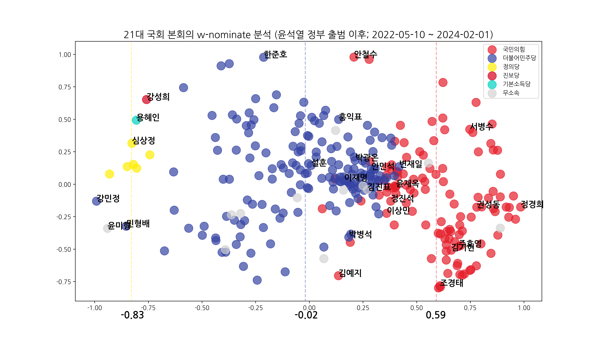
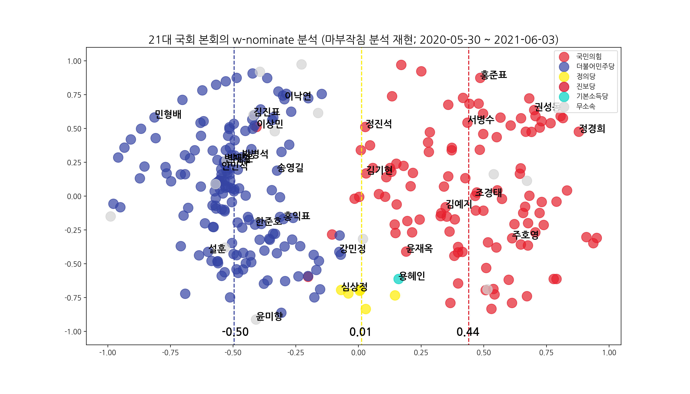

# 한국 21대 국회 w-nominate 분석 (윤석열 취임 이후)

윤석열 대통령 취임 이후 각 정당 의원들의 표결 성향은 어떻게 달라졌는지 분석하였습니다.

그 결과 더불어민주당과 국민의힘은 다시 가까워졌고, (녹색)정의당을 포함한 진보정당은 멀어진 것을 확인할 수 있었습니다.

## 대상

윤석열 취임 시점인 2022년 5월 10일부터 현 시점인 2024년 2월 1일까지, [국회 법률 표결 정보](https://open.assembly.go.kr/portal/data/service/selectServicePage.do?infId=OQ68B8001071ZB13418&infSeq=1&isInfsPop=Y)를 분석하였습니다.

## 방법

[마부작침 분석](https://news.sbs.co.kr/news/endPage.do?news_id=N1006341365) 및 여타 분석에 사용된 w-nominate를 활용하였습니다.

분석에는 R을, 데이터 수집과 그래프 시각화에는 Python 기반 Notebook을 이용하였습니다.

## 결과

x축 기준으로 민주당이 대체로 중앙에, 국민의힘이 + 방향, 진보정당들이 - 방향에 놓였습니다.

y축 상으로는 정당 간의 차이는 크지 않았습니다.

민주당을 중심으로 봤을 때, 당대표를 맡았던 의원들은 민주당 의원의 평균보다 더 +에 가까운 것을 확인할 수 있었습니다. 이들은 유사한 위치에 자리하면서 일종의 클러스터를 구성하였습니다.

국민의힘의 경우에도 마찬가지로, 당대표들을 중심으로 클러스터가 형성되어 있었습니다. 다만 이 클러스터는 민주당 전현직 당대표 클러스터와 겹치는 클러스터, 그리고 국민의힘 평균에 가까운 클러스터 둘로 나뉘었습니다.

## 마부작침 분석과의 비교

마부작침 분석은 1. 정치적 의미가 불분명한 축을 "진보" "보수"로 명명한 점, 2. 하나의 축을 중심으로 분석하고 나머지 축에 의한 설명 가능성을 뭉뚱그린 점, 3. 한 정당에 단독의결과 공포권이 동시에 있는 상황을 반영하기 어려웠던 점, 4. 21대 국회의 성향을 판단하기에는 조사 기간이 짧은 점 등으로 비판을 받았습니다.

2차원 그래프를 보면 알 수 있듯이, 진보정당들은 중간 역할을 하는 것이 아닌 3자 구도에 가깝게 나타났습니다.

또한 대선 이후와 비교해 보면, 윤석열 정부가 출범하면서 민주당이 다시 국민의힘에 더 가까운 성향으로 복귀하고, 진보정당은 더 먼 성향으로 나타난 것을 알 수 있습니다.
